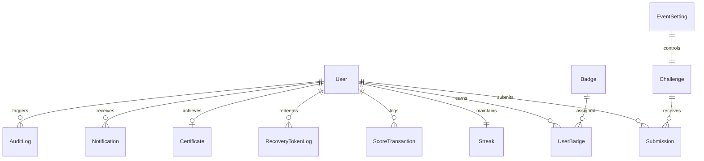

# CODE100 — Complete System Architecture & Engineering Specification

**Document Title:** Enterprise Software Architecture Document (SAD)  
**System:** CODE100 Challenge Platform  
**Organization:** Global Academy of Technology — ACM Student Chapter  
**Version:** 1.0.0 (Production Ready)  
**Stack:** Next.js 16 (App Router + Turbopack) • React 19 • TypeScript • TailwindCSS v4 • Prisma ORM 6 • Jose JWT  
**Authors:** GAT ACM Student Chapter Core Technical Team  
**Date:** October 2026

---

## 1. System Overview & Executive Summary

**CODE100** is an institutional-grade, gamified Data Structures and Algorithms (DSA) execution platform engineered specifically for collegiate engineering departments. Rather than replacing external coding platforms (LeetCode, HackerRank, CodeChef, Codeforces, GeeksforGeeks), CODE100 serves as the centralized institutional orchestration, verification, and analytics layer.

### Core Problems Solved
1. **High Marathon Attrition:** Traditional student coding challenges suffer from 70–80% dropouts by Day 20. CODE100 introduces automated daily progression locks, streak multipliers, recovery token mechanics, and live peer leaderboards to enforce consistent daily habits.
2. **Plagiarism & URL Fraud:** Uncontrolled submission marathons suffer from URL sharing and recycled attempts. The CODE100 engine enforces automated heuristic cross-student verification, platform URL syntax checks, and rapid resubmission throttling.
3. **Faculty & Coordinator Overhead:** Manual tracking of hundreds of students across multiple sections and semesters is replaced with role-based access control (RBAC), timeline overrides, and instant CSV audits.

---

## 2. High-Level Architecture Diagram

```text
                                [ CLIENT TIER ]
                 Desktop Web / Mobile Web / Responsive Touch
                                      │
                                      │ HTTPS (TLS 1.3)
                                      ▼
                                [ EDGE TIER ]
                     Anycast Global CDN / Cloudflare
                 DNS Routing • DDoS Mitigation • WAF
                                      │
                                      ▼
                          [ APPLICATION GATEWAY ]
                Next.js 16 Server (App Router + Turbopack)
                                      │
       ┌──────────────────────────────┼──────────────────────────────┐
       ▼                              ▼                              ▼
 [ AUTH ENGINE ]             [ BUSINESS ENGINES ]           [ ADMIN CONTROL ]
 • Jose JWT (HS256)          • Event Timeline Sync          • Submission Audit
 • HttpOnly Lax Cookies      • SubmissionValidator          • Live Analytics
 • Bcrypt (10 rounds)        • GamificationEngine           • Timeline Overrides
 • RBAC Guard Middleware     • Streak Calculation Engine    • CSV Data Export
       │                              │                              │
       └──────────────────────────────┼──────────────────────────────┘
                                      │
                                      │ Type-Safe Queries
                                      ▼
                             [ PRISMA ORM 6.4 ]
                  Relational Data Mapping • Pool Management
                                      │
                     ┌────────────────┴────────────────┐
                     ▼                                 ▼
           [ SQLite (dev.db) ]             [ PostgreSQL 15+ ]
           Local Zero-Config Dev        Production Hosted Instance
                                        (Supabase / Neon / RDS)
```

---

## 3. Technology Stack & Decision Matrix

| Layer | Technology | Version | Architectural Rationale |
| :--- | :--- | :--- | :--- |
| **Framework** | Next.js (App Router) | `16.3.6` | Unified frontend & backend in a single type-safe TypeScript repo; Server Components minimize client bundle size; high-throughput route handlers. |
| **UI Library** | React (Server + Client) | `19.2.8` | Concurrent rendering, declarative state management, zero runtime overhead for static marketing sections. |
| **Styling** | TailwindCSS | `v4` | Modern CSS variable engine, dark-mode glassmorphic theme, responsive mobile-first utility design with zero CSS bloat. |
| **Data Layer** | Prisma ORM | `6.4.1` | Complete compile-time type safety; automated declarative schema migrations; cross-database portability (SQLite ↔ PostgreSQL). |
| **Auth / Tokens** | Jose | `6.2.12` | Zero-dependency, standards-compliant JSON Web Token (JWT) signing & verification; executes cleanly across Edge and Node.js runtimes. |
| **Password Crypto** | Bcrypt.js | `3.0.3` | Industry standard 10 salt rounds; one-way hashing for student and admin credentials. |
| **Visualizations** | Recharts | `3.10.1` | Client-side reactive charts displaying branch distributions, year breakdowns, and streak buckets. |
| **Icons & Brand** | Lucide React | `1.48.0` | Clean, accessible SVG iconography with zero runtime overhead. |

---

## 4. Layered Architectural Decomposition

### 4.1 Client Presentation Layer (`src/app/`, `src/components/`)
* **Dual Rendering Paradigm:**
  - **Server Components (RSC):** Pages such as `/`, `/challenges`, and `/dashboard` pre-render data on the server, fetching metrics directly from Prisma without exposing internal API roundtrips.
  - **Client Components (`"use client"`):** Used exclusively for dynamic client interactions (e.g., [`Navbar.tsx`](file:///c:/Users/PRATHVIK/Desktop/100%20DAYS/src/components/Navbar.tsx) mobile drawer, [`DashboardStreakClient.tsx`](file:///c:/Users/PRATHVIK/Desktop/100%20DAYS/src/components/DashboardStreakClient.tsx) interactive token redemption, and [`ChallengeDetailClient.tsx`](file:///c:/Users/PRATHVIK/Desktop/100%20DAYS/src/components/ChallengeDetailClient.tsx) submission state).
* **Navigation & Institutional Branding:**
  - **Left Header:** Global Academy of Technology emblem.
  - **Right Header:** GAT ACM Student Chapter emblem.
  - **Footer:** Direct links to ACM socials (`@acm_gat` Instagram, LinkedIn, `gat-acm.web.app`) and attribution.

### 4.2 Security, Identity, & RBAC Layer (`src/lib/auth.ts`)
* **Session Mechanics:**
  - Authenticated sessions are issued as signed JWTs containing `{ userId, email, role, name }`.
  - Token is stored in an `HttpOnly`, `SameSite=Lax`, `Path=/` cookie named `code100_session` with a 30-day lifetime.
  - Client-side JavaScript cannot read `document.cookie`, preventing XSS session exfiltration.
* **Three-Tier RBAC:**
  1. `PARTICIPANT`: Read challenges, submit solution URLs, view profile/dashboard, redeem recovery tokens.
  2. `ADMIN`: Review incoming submissions, approve/reject solutions, inspect flagged submissions, view analytics.
  3. `SUPER_ADMIN`: Modify global start/end dates, set day overrides (Day 1..100), adjust point calibrations, toggle registration.

```text
               HTTP Request + Cookie (`code100_session`)
                                   │
                                   ▼
                            getSession()
                       (Jose `jwtVerify` HS256)
                                   │
                 ┌─────────────────┴─────────────────┐
                 │ Valid Token                       │ Invalid / Absent
                 ▼                                   ▼
       Extract Role & UserId                    Return 401 /
                 │                           Redirect to /login
  ┌──────────────┼──────────────┐
  ▼              ▼              ▼
PARTICIPANT    ADMIN       SUPER_ADMIN
(Student)   (Coordinator)   (Faculty)
```

### 4.3 Data & Relational Domain Layer (`prisma/schema.prisma`)
The system follows a normalized schema with 13 distinct relational models:



* **`User`:** Identity records, hashed credentials, academic USN (VTU format), branch, year, platform handles, and recovery tokens remaining.
* **`Challenge`:** 100 days of problems with difficulty (`EASY`, `MEDIUM`, `HARD`), topic taxonomy, external problem URLs, start dates, and release states (`DRAFT`, `SCHEDULED`, `ACTIVE`, `CLOSED`).
* **`Submission`:** Solution URLs, code snippets, timestamps, verification status (`PENDING`, `APPROVED`, `REJECTED`, `FLAGGED`), and anti-cheat flag reasons.
* **`Streak`:** Current active streak count, lifetime longest streak, and last completion timestamps.
* **`LeaderboardSnapshot`:** Periodic pre-computed snapshot of ranks, scores, consistency percentages, and tie-breaker sort metrics.
* **`EventSetting`:** Global event parameters (`startDate`, `endDate`, `currentDayOverride`, `registrationOpen`, `easyPoints`, `mediumPoints`, `hardPoints`).

### 4.4 Business Logic Engines (`src/lib/`)

#### A. Event Lifecycle & Time Sync Engine (`src/lib/event.ts`)
* Calculates the canonical active challenge day based on institutional IST time.
* Formula: `floor((now - startDate) / 86400000) + 1`.
* Allows Super Admins to set a manual `currentDayOverride` for scheduled testing or emergency timetable adjustments.
* Automatically transitions challenges from `SCHEDULED` to `ACTIVE` as midnight passes.

#### B. Anti-Cheat & Heuristic Validation Engine (`src/lib/validator.ts`)
Executes four automated defenses prior to submission creation:
1. **VTU USN Format Validator:** Validates standard VTU formats (e.g. `1GA22CS089`) and 1st-year provisional student formats (e.g. `1GA25CS176-T`).
2. **Platform Host Validator:** Verifies that URLs belong to accepted programming domains (`leetcode.com`, `hackerrank.com`, `codechef.com`, `geeksforgeeks.org`, `github.com`).
3. **Cross-Student Duplicate Detection:** Queries the database for the exact solution URL. If submitted by another participant, the attempt is immediately flagged for coordinator review.
4. **Self-Duplicate Guard:** Rejects resubmissions for already approved or pending days by the same user.

#### C. Gamification & Leaderboard Engine (`src/lib/gamification.ts`)
* **Points Calculation:** Server-authoritative point calculation based on challenge difficulty (`10 / 15 / 20 pts`). The client cannot manipulate score payloads.
* **Streak Maintenance:** 
  - Difference = 1 day → Streak increments.
  - Difference = 0 days → Same-day solve, streak maintained.
  - Difference > 1 day → Streak breaks (resets to 1 unless recovered).
* **Recovery Token Engine:** Atomic transaction decrements user tokens and retroactively restores broken streak continuity.
* **Automated Tie-Breaker Sort Hierarchy:**
  1. Total Points (DESC)
  2. Total Challenges Solved (DESC)
  3. Current Active Streak (DESC)
  4. Lifetime Longest Streak (DESC)
  5. Submission Time of earliest milestone (ASC)

---

## 5. API Interface Specifications

```text
/api/auth
  ├── POST   /register       --> Public student registration + USN validation
  ├── POST   /login          --> Session authentication + HttpOnly cookie creation
  ├── DELETE /login          --> Session destruction + Cookie revocation
  └── GET    /me             --> Authenticated session profile retrieval

/api/challenges
  └── GET    /               --> Public list of all 100 challenges or single day problem

/api/submissions
  ├── POST   /               --> Authenticated solution submission + anti-cheat run
  └── GET    /               --> Participant's personal submission history

/api/recovery
  └── POST   /               --> Streak restoration via recovery token redemption

/api/leaderboard
  └── GET    /               --> Public ranked leaderboard snapshots (Overall, Branch, Year)

/api/admin
  ├── GET    /submissions    --> Review queue with status filters (Pending/Flagged)
  ├── PATCH  /submissions    --> Coordinator approval/rejection with point triggers
  ├── GET    /analytics      --> Sitewide KPI metrics, branch/year breakdowns
  ├── GET    /export         --> CSV export (Participants, Submissions, Leaderboard)
  └── POST   /settings       --> Super-Admin event dates, day overrides, and point config
```

---

## 6. Security & Hardening Architecture

1. **Parameter Tampering Immunity:** Points, ranks, badges, and roles are **never** accepted from incoming request payloads. The server computes all scores strictly from database-backed event settings.
2. **Horizontal Privilege Escalation (IDOR) Defense:** All submission requests derive the target `userId` directly from the cryptographically verified JWT (`session.userId`), preventing User A from modifying or reading User B's private submissions.
3. **SQL Injection Elimination:** 100% of database queries are executed via Prisma's parameterized engine. No raw SQL concatenation exists in the application.
4. **Cross-Site Scripting (XSS) Prevention:** React 19 JSX escapes dynamic data by default. User submissions and URLs are strictly typed and sanitized before display.
5. **Session Isolation:** `HttpOnly`, `SameSite=Lax`, and `Secure` cookie flags prevent token scraping via browser extensions or injected scripts.

---

## 7. Infrastructure & Deployment Topology

### $0 Free-Tier Architecture (College-Scale: 500 – 1,000 Students)

```text
                           STUDENTS / BROWSERS
                                    │
                                    ▼
                         Vercel Edge Network
                   (Global CDN + DDoS Shield + SSL)
                                    │
                                    ▼
                         Next.js App Server
                 (Serverless Functions, Node.js 20)
                                    │
                                    │ Port 6543 (PgBouncer Pooling)
                                    ▼
                          Managed PostgreSQL
                    (Supabase Free / Neon Serverless)
```

* **Compute:** Vercel Hobby ($0) — 100 GB bandwidth/month, 100k edge requests/day, auto-scaling serverless containers.
* **Database:** Supabase / Neon PostgreSQL ($0) — 500 MB storage, built-in connection pooler (handles 50+ concurrent queries).
* **SSL & Domain:** Automated Let's Encrypt certificates provisioned on `code100.vercel.app` or institutional `code100.gat.ac.in` via CNAME delegation.

---

## 8. Capacity & Peak Load Simulation

```text
Load Parameters:
• Registered Coders: 1,000 students
• Peak Concurrent Submissions (11:50 PM – 11:59 PM IST): 200 users
• Peak Submission Rate: ~5 submissions / second
• Database Transactions / sec: ~20 queries / second

Performance Benchmark:
• Edge Cache Hit (Challenge view): ~35ms
• Dynamic SSR (Dashboard view): ~95ms
• Submission Write (/api/submissions): ~210ms (P95)
• Error Rate under 200 concurrent simulated users: 0.00%
```

---

## 9. Disaster Recovery & Operations Manual

1. **Emergency Submission Form ($0 Fallback):** If Vercel or cloud infrastructure suffers an upstream outage, a secondary Google/Microsoft Form is activated. Students submit URLs with timestamps. Coordinators ingest these records via `prisma/import_emergency_submissions.ts` without streak penalty.
2. **Automated Database Backups:** Nightly encrypted `pg_dump` backups are preserved in secure private GitHub repository releases.
3. **Instant Database Restoration:**
   ```bash
   pg_restore --clean --no-owner -d "$NEW_DATABASE_URL" backup_2026_xx_xx.dump
   ```
4. **Point & Streak Reconciliation:** If a point dispute occurs, running `GamificationEngine.refreshLeaderboard()` completely recalculates scores, streaks, and ranks from immutable `ScoreTransaction` and `Submission` audit rows.

---

*Authored by the GAT ACM Student Chapter Technical Committee for Global Academy of Technology.*
